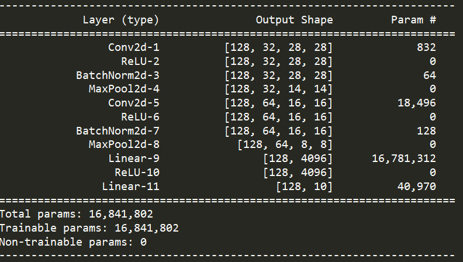

# fashionMNIST_CNN

## CNN模型

# 

## 模型参数



## CNN 模型描述

6层结构，2层卷积 + 2层最大池化 + 2层全连接层

- kernel size： , stride = 1, padding = 2; , stride = 1, padding = 2
- AvgPooling：, stride: 1
- 本实验使用ReLU激活函数

## python相关配置

- python 3.6
- modelsummary==1.1.7
- music21==5.7.2
- numpy==1.16.4
- pandas==1.0.4
- tensorboard==1.14.0
- torch==1.4.0+cu100
- torchvision==0.5.0+cu100

## 优化函数

```
SGD + Nesterov Momentum
```

## 模型准确率

| 训练集准确率            | 验证集准确率             | 测试集准确率            |
| ----------------------- | ------------------------ | ----------------------- |
| <center>93.01%</center> | <center>93.04%</center> | <center>93.75%</center> |

## 模型训练

```python
CUDA_VISIBLE_DEVICE=0 python train.py
```

**CUDA_VISIBLE_DEVICE**对应显卡序号，本实验所用显卡为一块GeForce GTX 1080 Ti：

```python
nvidia-smi
```

训练时会自动保存验证集准确率较高的pth文件，以供测试

## 模型测试

由于本数据集没有区分测试集和验证集，故每次迭代随机从测试集中取batch_size的样本作为验证集，方便训练过程调整超参数

将测试集中的PATH改为对应保存的pth文件即可

```python
CUDA_VISIBLE_DEVICE=0 python test.py
```

## TO DO

- [ ] README.md in English

## 参考

- [1] [ashmeet13](https://github.com/ashmeet13)
- [2]  Fashion-MNIST: a Novel Image Dataset for Benchmarking Machine Learning Algorithms. Han Xiao, Kashif Rasul, Roland Vollgraf. [arXiv:1708.07747](http://arxiv.org/abs/1708.07747)

